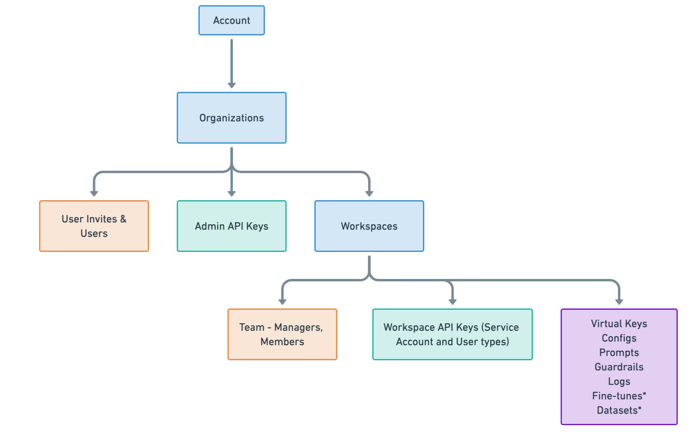
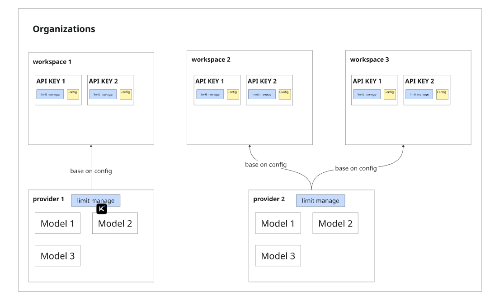

# Overview

## org of ai gateway

Portkey’s organization management structure provides a hierarchical system for managing teams, resources, and access within your AI development environment. This structure is designed to offer flexibility and security for enterprises of various sizes.
The account hierarchy in Portkey is organized as follows:

This hierarchy allows for efficient management of resources and access control across your organization. At the top level, you have your Account, which can contain one or more Organizations. Each Organization can have multiple Workspaces, providing a way to separate teams, projects, or departments within your company.

Organizations contain User Invites & Users, Admin API Keys, and Workspaces. Workspaces, in turn, have their own Team structure (with Managers and Members), Workspace API Keys, and various features like Integrations, Model Catalog, Configs, Prompts, and more.
This structure enables you to:
* Maintain overall control at the Organization level
* Delegate responsibilities and access at the Workspace level
* Ensure data separation and project scoping
* Manage teams efficiently across different projects or departments

