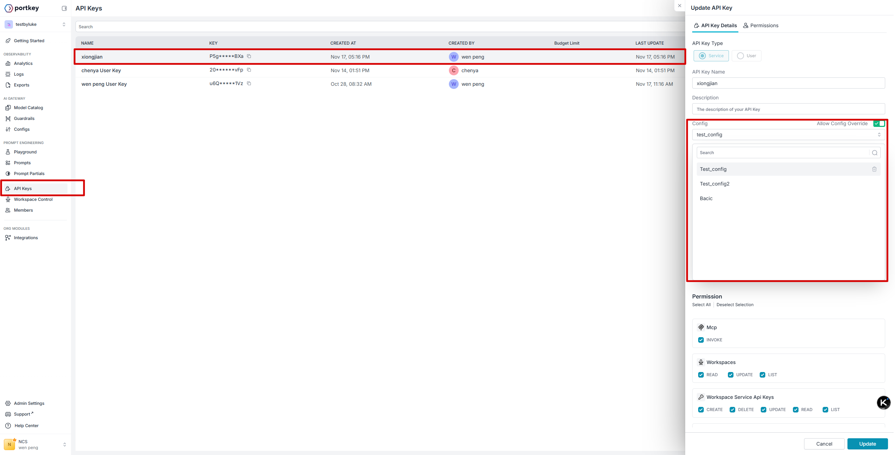
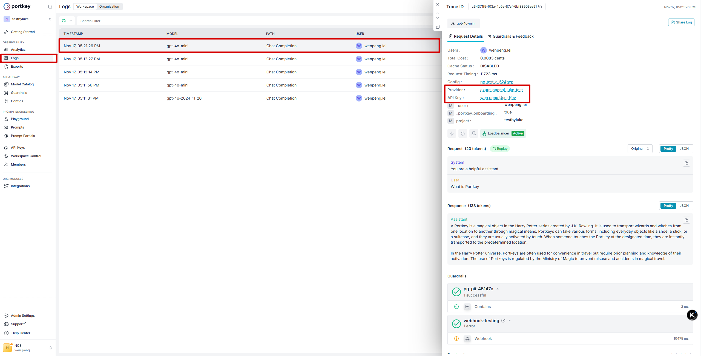

# Configs

> This feature is available on all Portkey plans.

<Info>
  Available on all Portkey plans.
</Info>

Configs streamline your Gateway management, enabling you to programmatically control various aspects like fallbacks, load balancing, retries, caching, and more.

A configuration is a JSON object that can be used to define routing rules for all the requests coming to your gateway. You can configure multiple configs and use them in your requests.

## Creating Configs

Navigate to the ‘Configs’ page in the Portkey app and click 'Create' to start writing a new config.

## Using Configs

Configs are supported across all integrations.

* Through the config parameter of the Portkey SDK client(Directly or via [frameworks](https://portkey.ai/docs/integrations/llms))
* Through the config headers in the OpenAI SDK
* Via the REST API through the `x-portkey-config` header

### Setting Default Configs on API Keys

You can attach a default config directly to an API key, which means all requests made with that key will automatically use the specified config without needing to include it in each request. This is particularly useful for:

* **Integrations that don't support custom headers** (like Open WebUI, LibreChat, and other OpenAI-compatible interfaces)
* **Enforcing organization-wide governance policies** without requiring code changes
* **Centralized configuration management** where all applications using a specific API key share the same routing, fallbacks, and caching rules

When you attach a default config to an API key, every request made with that key automatically applies the config's settings (routing, fallbacks, caching, etc.), even if the application doesn't send the `x-portkey-config` header.

To set a default config on an API key:

1. Navigate to [API Keys](https://app.portkey.ai/api-keys) in the Portkey dashboard
2. Create a new API key or edit an existing one
3. In the API key settings, select a config from the **Default Config** dropdown
4. Save the API key



* The default config attached to the API key will be automatically applied to all requests made with that key
* By default, if a user explicitly specifies a config ID in their request, that config will override the default config attached to the API key
* You can now disable config overrides by toggling off “Allow Config Override” when creating or editing API keys

<Note>
  If you specify a config in a request (via headers or SDK parameters), it will override the default config for that specific request. The default config only applies when no config is specified in the request itself.
</Note>

## Configs in Logs

Portkey shows your Config usage smartly on the logs page with the **Status column** and gives you a snapshot of the Gateway activity for every request. [Read more about the status column here](https://portkey.ai/docs/product/observability/logs#request-status-guide).

You can also see the ID of the specific Config used for a request separately in the log details, and jump into viewing/editing it directly from the log details page.



## Config Object Documentation

Find detailed info about the Config object schema, and more examples:

[https://portkey.ai/docs/api-reference/inference-api/config-object#examples](https://portkey.ai/docs/api-reference/inference-api/config-object#examples)


## Config examples

### cache
Speed up and save money on your LLM requests by storing past responses in the Portkey cache. There are 2 cache modes:
* `Simple`: Matches requests verbatim. Perfect for repeated, identical prompts. Works on all models including image generation models.
* `Semantic`: Matches responses for requests that are semantically similar. Ideal for denoising requests with extra prepositions, pronouns, etc. Works on any model available on /chat/completionsor /completions routes

``` json
{
  "cache": {
    "mode": "simple",
    "max_age": 60
  }
}
```

* Minimum cache age is 60 seconds
* Maximum cache age is 90 days (i.e. 7776000 seconds)
* Default cache age is 7 days (i.e. 604800 seconds)

### Fallback

With an array of Language Model APIs available on the market, each with its own strengths and specialties, wouldn’t it be great if you could seamlessly switch between them based on their performance or availability? Portkey’s Fallback capability is designed to do exactly that. The Fallback feature allows you to specify a list of providers/models in a prioritized order. If the primary LLM fails to respond or encounters an error, Portkey will automatically fallback to the next LLM in the list, ensuring your application’s robustness and reliability.

``` json
{
  "strategy": {
    "mode": "fallback"
  },
  "targets": [
    {
      "provider": "@openai-virtual-key",
      "override_params": {
        "model": "gpt-4o"
      }
    },
    {
      "provider": "@anthropic-virtual-key",
      "override_params": {
        "model": "claude-3.5-sonnet-20240620"
      }
    }
  ]
}
```