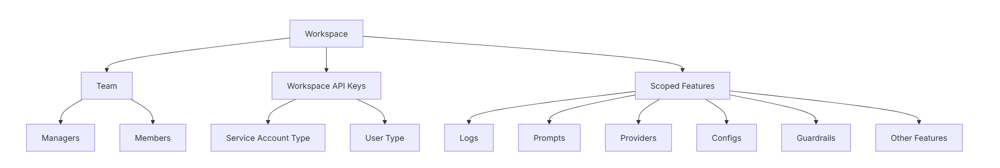
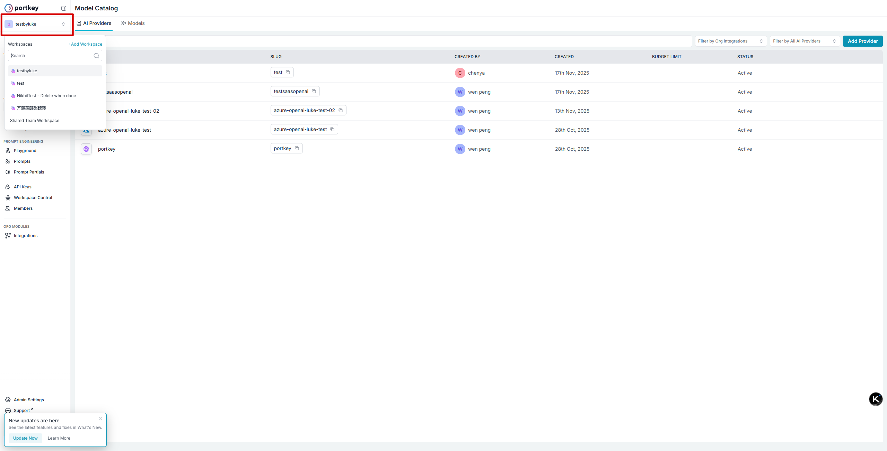
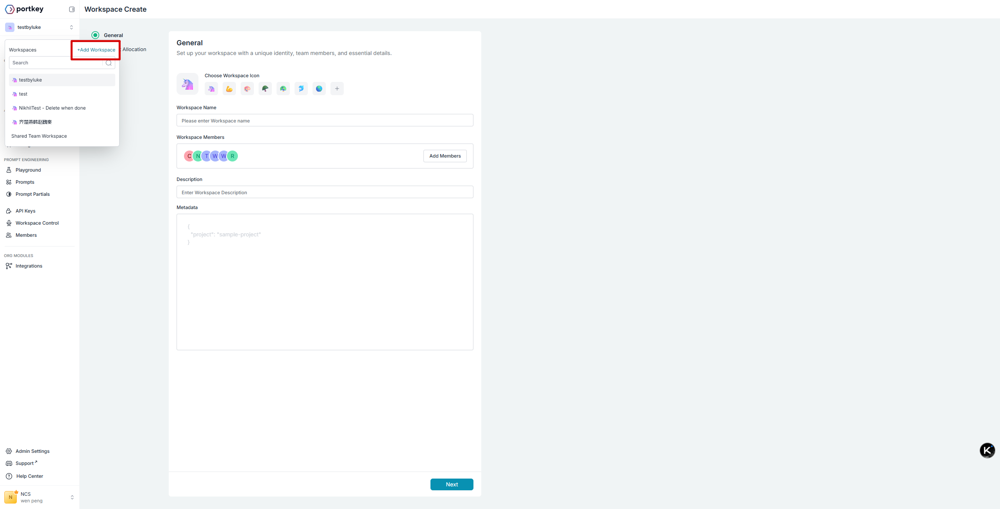
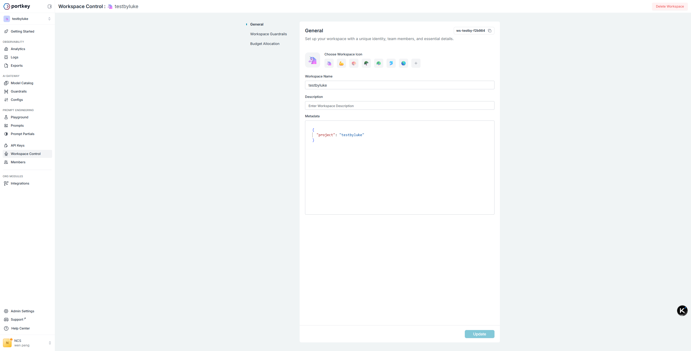
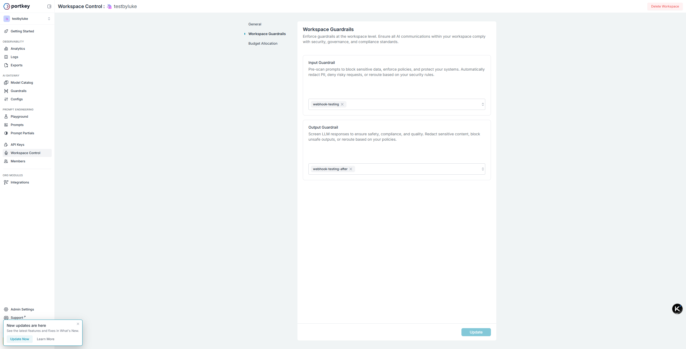
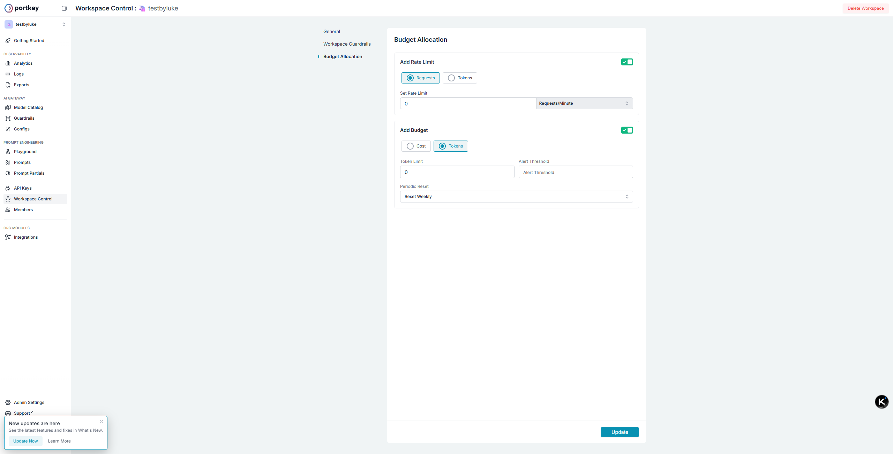
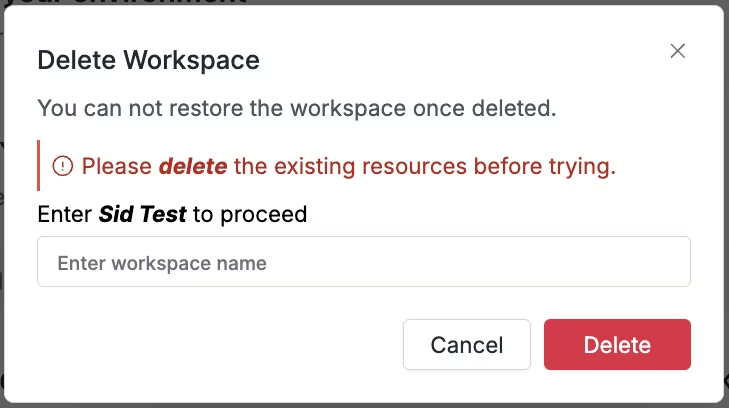

# Workspace

Workspaces in Portkey are sub-organizations that enable better separation of data, teams, scope, and visibility within your larger organization.

They provide a more granular level of control and organization, allowing you to structure your projects and teams efficiently.

Key features of Workspaces:
* `Team Management`: You can add team members to workspaces with specific roles (manager or member), allowing for precise access control.
* `Dedicated API Keys`: Workspaces contain their own API keys, which can be of two types:
  * `Service Account type`: For automated processes and integrations
  * `User type`: For individual user access
  * Both these types of keys are scoped to the workspace by default and can only execute actions within that workspace.
* `Completion API Scoping`: Completion APIs are always scoped by workspace and can only be accessed using workspace API keys.
* `Admin Control`: While only org admins can create workspaces, managers can add API keys and team members with roles to existing workspaces.
* `Flexible Updates`: When making updates to entities via admin keys (at the org level), you can specify the workspace_id to target specific workspaces.

## list of workspace

## manage workspace in action

### create workspace

> can also set `Budget Allocation` for this newly created workspace

### update workspace

#### workspace general control

#### workspace guardrail config

`prerequisite`: you have configured guardrail. Refer to the guardrail config.

#### workspace budget allocation

  
##### Cost-Based Limits
Set a budget limit in USD that, once reached, will automatically expire the key to prevent further usage and overspending.

##### Token-Based Limits
Set a maximum number of tokens that can be consumed, allowing you to control usage independent of cost fluctuations.
And you can set both these limtis for each workspace.

### Deleting a Workspace

Before deleting a workspace, all resources within it must be removed.
You can’t delete the default Shared Team Workspace.

To delete a workspace in Portkey, follow these steps:
* Navigate to the sidebar in the Portkey app
* Open the workspace menu dropdown
* Select the workspace you wish to delete
* Click on the delete option (trash icon) next to the workspace name

When attempting to delete a workspace, you’ll receive a confirmation dialog. If the workspace still contains resources, you’ll see a warning message prompting you to delete these resources first.

Resources that must be deleted before removing a workspace like - Prompts, Prompt partials, Providers, Configs, Guardrails and more.
Once all resources have been removed, enter the workspace name in the confirmation field to proceed with deletion.