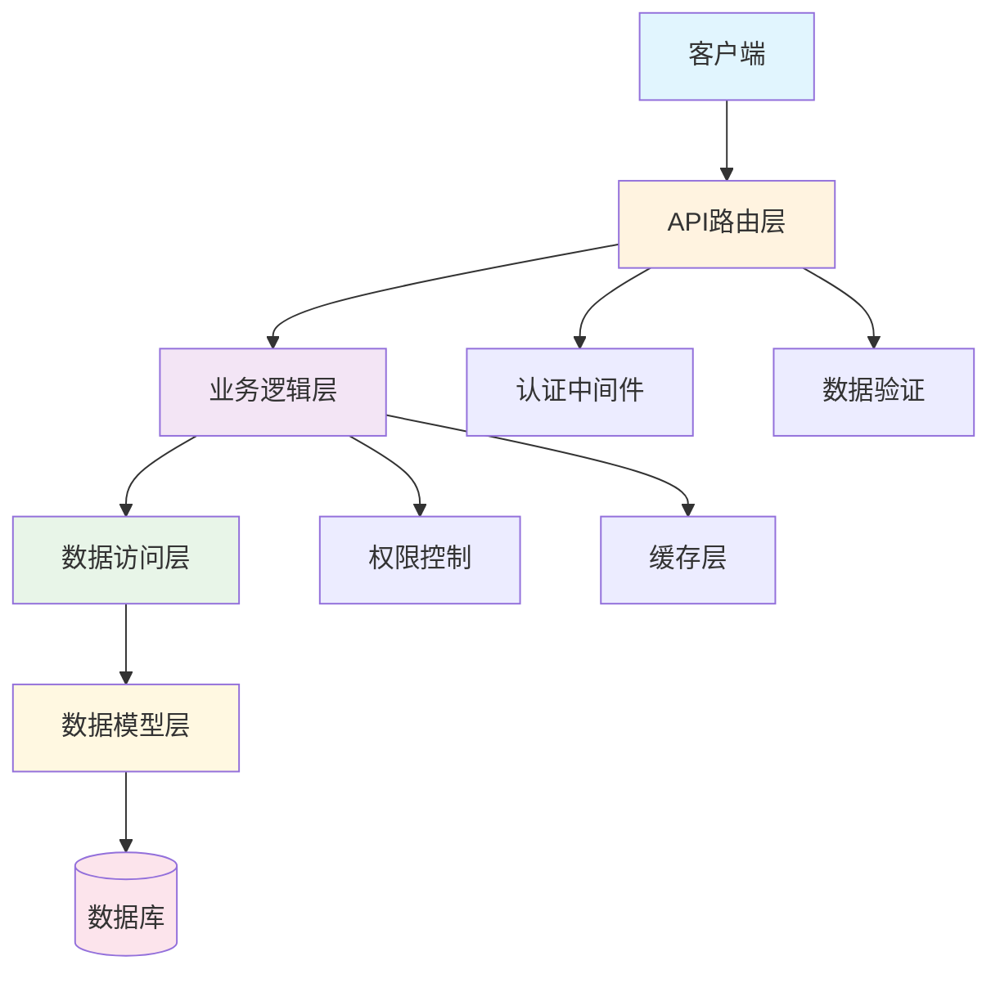
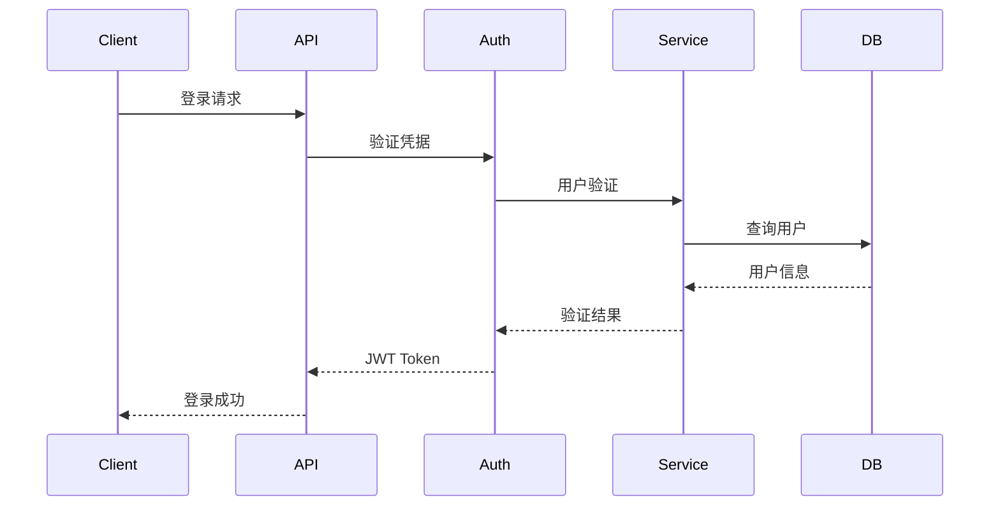
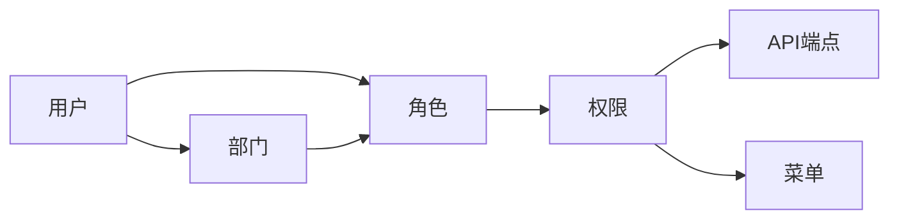
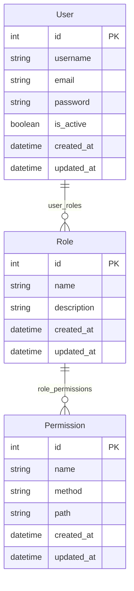

# 架构设计

## 系统架构概览

FastAPI Backend Template 采用了经典的三层架构设计，确保了代码的可维护性、可扩展性和可测试性。



## 核心设计原则

### 1. 单一职责原则
每个层次都有明确的职责，避免职责混淆：

- **API层**: 处理HTTP请求和响应
- **Service层**: 实现业务逻辑
- **Repository层**: 数据访问和持久化
- **Model层**: 数据结构定义

### 2. 依赖倒置原则
高层模块不依赖低层模块，通过接口实现解耦：

```python
# Service层依赖Repository抽象
class UserService:
    def __init__(self, user_repo: UserRepository):
        self.user_repo = user_repo
```

### 3. 开闭原则
对扩展开放，对修改关闭：

```python
# 通过继承扩展功能
class EnhancedUserService(UserService):
    def create_user_with_notification(self, user_data):
        user = super().create_user(user_data)
        self.send_notification(user)
        return user
```

## 层次架构详解

### API层 (src/api/v1/)
负责处理HTTP请求和响应，包括：

- **路由定义**: 定义API端点
- **请求验证**: 验证输入参数
- **响应格式化**: 统一响应格式
- **异常处理**: 统一错误处理

```python
@router.post("/users", response_model=UserResponse)
async def create_user(user_data: UserCreate):
    """创建用户API端点"""
    return await user_service.create_user(user_data)
```

### Service层 (src/services/)
包含核心业务逻辑，包括：

- **业务规则**: 实现业务逻辑
- **权限验证**: 检查用户权限
- **事务管理**: 协调多个操作
- **缓存管理**: 数据缓存策略

```python
class UserService:
    async def create_user(self, user_data: UserCreate):
        # 业务逻辑验证
        if await self.user_repo.exists(email=user_data.email):
            raise ValueError("邮箱已存在")

        # 密码加密
        user_data.password = hash_password(user_data.password)

        # 创建用户
        return await self.user_repo.create(user_data)
```

### Repository层 (src/repositories/)
负责数据访问，包括：

- **CRUD操作**: 基础数据操作
- **查询构建**: 复杂查询构建
- **数据映射**: 模型和DTO转换
- **事务控制**: 数据库事务管理

```python
class UserRepository:
    async def create(self, user_data: UserCreate) -> User:
        return await User.create(**user_data.dict())

    async def get_by_id(self, user_id: int) -> Optional[User]:
        return await User.get_or_none(id=user_id)
```

### Model层 (src/models/)
定义数据结构，包括：

- **数据模型**: Tortoise ORM模型
- **关系定义**: 表间关系配置
- **索引配置**: 数据库索引
- **约束定义**: 数据约束

```python
class User(BaseModel, TimestampMixin):
    id = fields.IntField(pk=True)
    username = fields.CharField(max_length=50, unique=True)
    email = fields.CharField(max_length=100, unique=True)

    # 关系定义
    roles = fields.ManyToManyField("models.Role", related_name="users")
```

## 核心组件

### 1. 认证系统
基于JWT的认证机制：



### 2. 权限控制
基于RBAC的权限模型：



### 3. 数据库设计
使用Tortoise ORM实现数据持久化：



## 设计模式

### 1. 依赖注入
使用FastAPI的依赖注入系统：

```python
# 依赖定义
def get_user_service() -> UserService:
    return UserService(user_repository)

# 使用依赖
@router.post("/users")
async def create_user(
    user_data: UserCreate,
    user_service: UserService = Depends(get_user_service)
):
    return await user_service.create_user(user_data)
```

### 2. 仓储模式
封装数据访问逻辑：

```python
class BaseRepository:
    def __init__(self, model: Type[Model]):
        self.model = model

    async def create(self, data: dict) -> Model:
        return await self.model.create(**data)

    async def get_by_id(self, id: int) -> Optional[Model]:
        return await self.model.get_or_none(id=id)
```

### 3. 服务层模式
封装业务逻辑：

```python
class BaseService:
    def __init__(self, repository: BaseRepository):
        self.repository = repository

    async def create(self, data: BaseModel) -> Model:
        # 业务逻辑处理
        validated_data = self.validate_data(data)
        return await self.repository.create(validated_data)
```

## 扩展指南

### 添加新功能模块

1. **创建模型** (src/models/):
```python
class Product(BaseModel, TimestampMixin):
    name = fields.CharField(max_length=100)
    price = fields.DecimalField(max_digits=10, decimal_places=2)
```

2. **创建仓储** (src/repositories/):
```python
class ProductRepository(BaseRepository):
    def __init__(self):
        super().__init__(Product)
```

3. **创建服务** (src/services/):
```python
class ProductService(BaseService):
    def __init__(self, product_repo: ProductRepository):
        super().__init__(product_repo)
```

4. **创建API** (src/api/v1/):
```python
@router.post("/products")
async def create_product(
    product_data: ProductCreate,
    product_service: ProductService = Depends(get_product_service)
):
    return await product_service.create(product_data)
```

### 自定义中间件

```python
@app.middleware("http")
async def custom_middleware(request: Request, call_next):
    # 处理请求前
    response = await call_next(request)
    # 处理响应后
    return response
```

## 性能优化

### 1. 数据库优化
- 使用 `select_related()` 预加载关联数据
- 使用 `prefetch_related()` 优化多对多查询
- 添加适当的数据库索引

### 2. 缓存策略
- 使用Redis缓存频繁查询的数据
- 实现查询结果缓存
- 设置合理的缓存过期时间

### 3. 异步处理
- 使用异步I/O操作
- 合理使用连接池
- 避免阻塞操作

## 总结

该架构设计提供了：

- ✅ **清晰的层次结构**
- ✅ **高度的可测试性**
- ✅ **良好的可扩展性**
- ✅ **强类型安全**
- ✅ **完整的错误处理**

通过遵循这些设计原则和模式，可以构建出稳定、高效、易维护的企业级应用。
